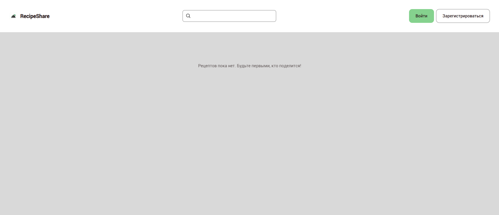
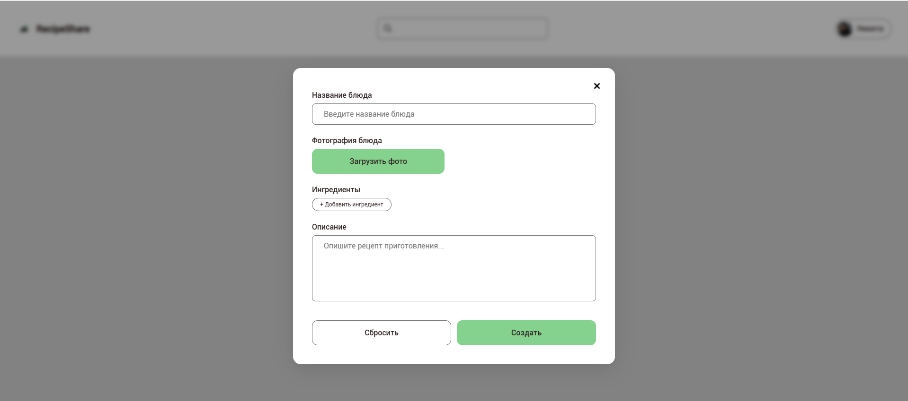

# 🍑 Платформа обмена рецептами "RecipeShare"

## О проекте
Проект "RecipeShare" представляет собой мой pet-проект, в котором я применяю новые изученные технологии и создаю полноценное веб-приложение для того, чтобы пользователи могли обмениваться своими рецептами и не забывать о том, где они храняться.

## 💡 Взгяд на проект
<div align="center">



</div>

## 💻 Используемые технологии
* Next.js
* Supabase 
* React
* TypeScript
* SASS

## ❓ Выбор стека технологий
Данный проект я создавал с использованием новых изученных технологий: Next.js и Supabase. Этот стек я выбрал неспроста. Выбор Next.js в качестве базы для проекта был обусловлен желанием использовать современные архитектурные подходы и получить гибкий контроль над работой веб-приложения. Next.js предоставляет гибкую интеграцию RSC. Благодаря явным директивам 'use client' и 'use server' мы можем четко разделять логику на серверные и клиентские компоненты.  Использование современного роутера на базе директории app/ позволило построить чистую и структурированную архитектуру проекта. Маршруты создаются автоматически на основе структуры папок. Выбор Supabase в качестве бэкенд-платформы был продиктован стремлением сочетать высокую скорость разработки с надежностью полноценной реляционной базы данных. Supabase предоставляет мощный инструментарий на базе PostgreSQL, что позволило отказаться от создания и поддержки отдельного бэкенд-сервера и сосредоточиться на проектировании пользовательского опыта. Встроенный сервис аутентификации взял на себя всю сложную логику регистрации, авторизации и безопасного управления сессиями пользователей, а политики безопасности на уровне строк обеспечили надежную защиту данных и разграничение прав доступа прямо на уровне базы. Кроме того, нативная интеграция Supabase с Next.js позволяет выполнять быстрые запросы к базе данных как с клиента, так и из серверных компонентов, а использование возможностей PostgreSQL, таких как представление SQL View, упростило сборку рецептов вместе со сведениями об авторах и лайках за один запрос без потери производительности.

## ▶️ Установка и запуск 
**1. Клонирование репозитория**
```bash
git clone git@github.com:nikita-pugachev/RecipeShare.git
```
**2. Запуск**
* Открыть проект в VS code или другом IDE.
* Установить зависимости 'npm install'
* Запустить проект с помощью комадны для терминала 'npm run dev'

## 📝 Сcылка на запуск
[Веб-приложение "RecipeShare"](https://recipeshare-lemon.vercel.app/)

## P.S:
Я активно ищу работу и стремлюсь развиваться, изучать что-то новое каждый день. Разработка Frontend-приложений приносит ине радость, я хочу делать проекты, которые будут помогать людям. Поэтому, если вы ищите сотрудника и вам понравился мой проект - свяжитесь со мной, пожалуйста 👋

## ✉️ Контакты автора
[](https://t.me/RUSSS1NG)
[](mailto:RUSSSSing@yandex.ru)